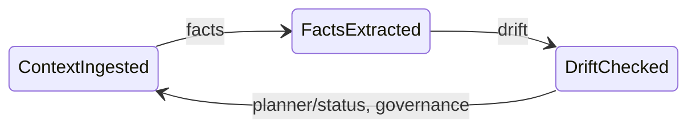

# Swarm of Governed Agents

> Can we replace orchestration-as-topology with governance-as-policy for agent coordination — with formal convergence guarantees?

Governed agent swarm: event-driven reasoning roles sharing a context, governed by policy, converging toward finality.

---

## Research question

Most agent frameworks coordinate via DAGs: fixed pipelines where topology determines sequence. This conflates *what comes next* with *should this happen at all*. The result is systems that are load-bearing and fragile simultaneously — every new rule, agent, or exception requires rewiring the graph.

This project tests an alternative hypothesis: **declarative governance over shared state, combined with a semantic graph and formal convergence tracking, can produce auditable, converging agent coordination without fixed pipelines.**

Concretely: four agents (facts, drift, planner, status) operate independently on shared context (Postgres WAL + S3). A governance agent enforces declarative transition rules and authorization policy (OpenFGA). A finality evaluator tracks convergence via a Lyapunov disagreement function and triggers human-in-the-loop review when the system plateaus. No agent knows about any other agent's existence. Coordination emerges from the shared state and the governance layer.

The formal guarantee: if the Lyapunov function V(t) decreases monotonically across evaluation cycles, the system is asymptotically converging toward finality. If V increases, the system detects divergence and escalates. If V stalls, it detects plateau and routes to human review. See [docs/convergence.md](docs/convergence.md) for the full theory.

---

## What this prevents

| Failure mode | How pipelines fail | How this design prevents it |
|---|---|---|
| **Premature closure** | Threshold check on a snapshot; transient spike triggers resolution | Monotonicity gate: score must be non-decreasing for 3 consecutive rounds |
| **Silent stagnation** | No detection mechanism; agents cycle forever at sub-threshold | Plateau detection: EMA of progress ratio triggers HITL when stalled |
| **Cascade failures** | DAG edge fails, everything downstream fails | No edges to fail; agents read shared state independently |
| **No audit trail** | Decisions scattered in code, no record of *why* | Every transition logged to append-only WAL with proposer, approver, rationale, governance path |
| **Unbounded lifecycles** | "Run until done" — but what is done? | Four terminal states: RESOLVED, ESCALATED, BLOCKED, EXPIRED — each with defined semantics |
| **Contradictions absorbed silently** | New data overwrites old | CRDT-inspired upserts; contradictions are first-class graph edges; governance blocks on drift |

---

## The case against straightjackets

Most agent frameworks default to the same design: a directed graph, a fixed pipeline, a hardcoded sequence of steps. The orchestrator decides what happens next. If an unexpected condition arises — conflicting data, a missing predecessor, a policy constraint — the system either crashes, silently skips it, or falls to a cascade of if-else branches.

The core problem is that **workflow orchestration conflates sequencing with reasoning**. A DAG answers "what comes next" but not "should this happen at all, given what we know." It bakes the coordination logic into the structure itself, which means every new agent, every new rule, every new exception requires rewiring.

Agents are increasingly capable of making local judgments. The open question is: how do we let them do so while keeping the overall system coherent, auditable, and safe? We want coherence to come from **shared state, shared policy, and a coordination mechanism that enforces invariants without prescribing sequence**.

---

## Governance, not orchestration

The alternative is **governed coordination**: agents operate independently on shared state, and what they are *allowed* to do is determined by declarative policy, not hard-coded call chains.

The architecture rests on three principles:

**1. Shared, append-only context.** Every agent reads from the same event log (Postgres WAL) and the same facts/drift state (S3). There is no "agent A's context" vs "agent B's context." There is context. Agents read it, reason over it, propose changes, and wait for approval.

**2. Proposals and approvals.** No agent directly advances the state. A facts agent proposes `FactsExtracted`; the governance agent checks whether that transition is currently allowed (given drift level, policy, epoch); the executor performs it if approved. This produces an audit trail: every transition has a reason, a proposer, and an approver.

**3. Declarative rules, not imperative code.** `governance.yaml` expresses transition rules and remediation actions. Rules are evaluated at runtime, not compiled into graph edges. Adding a new constraint is a YAML change, not a refactor.



The result: agents are **reasoning roles**, not pipeline stages. The coordination emerges from the shared context and the governance layer — not from wiring. See [docs/architecture.md](docs/architecture.md) for the full technical deep dive.

---

## Convergence: from memoryless to stateful

The original `evaluateFinality()` was memoryless — each invocation computed a fresh score and checked it against a threshold. A transient spike could trigger premature resolution; agents stuck at 0.65 would cycle forever.

The convergence tracker (`src/convergenceTracker.ts`) transforms finality into a stateful process with five mechanisms from the research literature:

1. **Lyapunov disagreement V(t)** — quadratic distance to finality targets; V = 0 means perfect finality ([Olfati-Saber & Murray, 2004](#references))
2. **Convergence rate alpha** — exponential decay rate with ETA estimation
3. **Monotonicity gate** — score must be non-decreasing for beta rounds before auto-resolve ([Duan et al., 2025](#references))
4. **Plateau detection** — EMA of progress ratio triggers HITL when stalled ([Camacho et al., 2024](#references))
5. **Pressure-directed activation** — per-dimension pressure routes agents to bottleneck dimensions ([Dorigo et al., 2024](#references))

| Condition | Outcome |
|-----------|---------|
| Score >= 0.92, all RESOLVED conditions met, monotonicity gate satisfied, trajectory quality >= 0.7 (Gate C), quiescence when configured (Gate D) | Auto-RESOLVED |
| Convergence rate alpha < -0.05 (system diverging) | ESCALATED |
| Score in [0.40, 0.92), plateau detected | HITL review with convergence context |
| Score in [0.40, 0.92), not plateaued | ACTIVE (keep iterating) |

The semantic graph sync uses **CRDT-inspired monotonic upserts**: claim confidence only increases, resolution edges are irreversible, stale nodes are marked irrelevant rather than deleted. This guarantees the goal score is a ratchet ([Laddad et al., 2024](#references)).

See [docs/convergence.md](docs/convergence.md) for the formal theory, configuration reference, and benchmark scenarios.

---

## The semantic graph

The **semantic graph** — Postgres with pgvector — makes the knowledge structure explicit. Claims, goals, risks, and assumptions are addressable nodes. Contradictions, resolutions, and supports are typed edges. The graph is updated after each extraction cycle via monotonic upserts; it persists across cycles.

The finality evaluator queries the graph to compute a goal score across four weighted dimensions: claim confidence (0.30), contradiction resolution (0.30), goal completion (0.25), and risk score (0.15). When the system is near finality but not quite, it routes to **human-in-the-loop review** with structured context — not a bare confidence number but convergence rate, ETA, bottleneck dimension, and score trajectory.

---

## Why OpenFGA

The governance rules handle *when* transitions are allowed. **OpenFGA** — an open implementation of Google Zanzibar ([Pang et al., 2019](#references)) — handles *who is allowed to do what to which resource*.

In this project, OpenFGA is wired into the governance agent's `checkPolicy` tool. When a proposal arrives, the agent checks both transition rules and authorization policy. Both can reject. Neither is in application code.

For enterprise use: auditability (the permission model is a first-class, versionable object), least privilege at scale (relationship model beats conditional logic), and dynamic policy (computed relationships, no redeployment).

---

## Scalability: from swarm to fabric

This prototype runs one swarm with four agents against one scope. The architecture is designed to scale:

**Multiple scopes.** Each scope is an isolated coordination context: its own semantic graph, finality state, convergence history, and MITL queue. OpenFGA enforces isolation.

**Multiple agents per role.** Pull-consumer model on NATS means ten facts agents can work the same stream. Epoch-based CAS prevents double-advances.

**Heterogeneous models.** The facts-worker is a pluggable Python service. Lighter models for low-stakes scopes, heavier ones for high-stakes — governance and finality stay constant.

**Declarative scaling.** Adding complexity means adding rules to `governance.yaml`, updating weights in `finality.yaml`, adjusting the OpenFGA model. The agents remain unchanged.

---

## Demo: Project Horizon

A governed agent swarm processes an M&A due diligence package in real time. Five documents, multiple contradictions, one human decision at the right moment.

**Scenario:** A pharmaceutical buyer evaluates NovaTech AG. Documents arrive over time revealing an ARR overstatement (EUR 50M claimed vs EUR 38M actual), a CTO departure, a patent infringement suit, and finally a legal review with a recommended acquisition path.

| Doc | Event | System response |
|-----|-------|-----------------|
| 1. Analyst Briefing | Baseline profile | Low finality (~0.15), no contradictions |
| 2. Financial Due Diligence | EUR 12M ARR discrepancy | Contradiction edges created, governance blocks on high drift |
| 3. Technical Assessment | CTO departure, key-person risk | Risk nodes accumulate, drift = medium |
| 4. Market Intelligence | Patent litigation | Escalation risk, multiple unresolved contradictions |
| 5. Legal Review | Settlement path, conditions | Near-finality HITL review triggered with structured options |

```bash
# Quick start (requires Docker, pnpm, LLM)
pnpm run demo              # Demo UI on port 3003
# or
./demo/run-demo.sh --fast  # Shell walkthrough
```

See [docs/demo.md](docs/demo.md) for the full walkthrough and [demo/DEMO.md](demo/DEMO.md) for the complete step-by-step guide.

---

## Validation

**268 unit tests** (Vitest) cover convergence math, finality decision paths, governance rule evaluation, semantic graph monotonicity, state machine CAS, policy engine, finality certificates, and Gate B/C/D. **7 convergence benchmark scenarios** validate the tracker with pure math (no Docker, no LLM). An **E2E pipeline** (`scripts/run-e2e.sh`) tests the full Docker stack from document ingestion through governance to semantic graph verification. **Governance path auditing** seeds three proposal modes (MASTER/MITL/YOLO) and verifies the audit trail.

**What's theoretical:** scalability beyond ~10 agents (architecture supports it, not stress-tested), multi-org OpenFGA isolation, long convergence runs over hundreds of epochs, adversarial robustness.

```bash
pnpm run test                                  # 268 unit tests
npx tsx scripts/benchmark-convergence.ts       # 7 convergence scenarios
./scripts/run-e2e.sh                           # Full E2E pipeline
```

See [docs/validation.md](docs/validation.md) for the complete test methodology and known gaps.

---

## Architecture

**Event bus:** NATS JetStream stream `SWARM_JOBS` with subjects `swarm.jobs.>`, `swarm.proposals.>`, `swarm.actions.>`, `swarm.events.>`. Durable pull consumers, one per agent instance.

**Context and state:** Postgres `context_events` (append-only WAL) and `swarm_state` (singleton, epoch CAS). S3 for facts, drift, and history.

**Semantic graph:** Postgres `nodes` and `edges` (optionally bitemporal: valid_from, valid_to, recorded_at, superseded_at per migration 011). Synced from facts via monotonic upserts; time-travel queries and append-over-update (supersede) supported.

**Convergence history:** Postgres `convergence_history` (scope_id, epoch, goal_score, lyapunov_v, dimension_scores JSONB, pressure JSONB). Append-only.

**Governance loop:** Planner proposes -> policy engine (YAML or OPA-WASM) evaluates rules -> OpenFGA checks -> executor performs approved advance. Every decision persisted to `decision_records` with policy version; obligations executed via enforcer.

**Finality certificates:** When a scope reaches RESOLVED, a signed JWS (Ed25519) is stored in `finality_certificates`. Summary API and `GET /finality-certificate/:scope_id` (MITL server) expose policy version and certificate for audit.

**Finality:** After each governance round, `evaluateFinality(scopeId)` runs against the semantic graph and convergence history. Monotonicity gate + plateau detection + divergence detection.

**Facts-worker:** Python (FastAPI + DSPy). Runs in Docker. Pluggable LLM backend (Ollama or OpenAI).

See [docs/architecture.md](docs/architecture.md) for the full technical deep dive.

---

## Stack

- **TypeScript** — orchestration, agents, state graph, convergence tracker, feed, tests.
- **Python** — facts-worker (DSPy; Ollama or OpenAI-compatible extraction).
- **Docker Compose** — Postgres (pgvector), MinIO, NATS JetStream, facts-worker, feed, OpenFGA, otel-collector.
- **NATS JetStream** — event bus.
- **Postgres + pgvector** — context WAL, state graph, semantic graph with optional 1024-d embeddings, convergence history.
- **MinIO** — S3-compatible blob store for facts, drift, and history.
- **OpenFGA** — policy checks (Zanzibar-style; optional but wired in).
- **Ollama or OpenAI** — extraction, rationale, HITL explanation, embeddings (`bge-m3`).

---

## Run locally

**Prerequisites:** Docker. Node 20+; pnpm (lockfile is `pnpm-lock.yaml`). OpenAI key or Ollama running locally with the extraction model pulled (e.g. `ollama pull qwen3:8b`).

```bash
cp .env.example .env
# Edit .env: set credentials and LLM config (see .env.example for all options)
docker compose up -d postgres s3 nats facts-worker feed
pnpm install
```

**Preflight** — ensures Postgres, S3, NATS, and facts-worker are reachable before starting. Use `CHECK_SERVICES_MAX_WAIT_SEC=300` on first run (facts-worker installs Python deps on startup). If checks fail, ensure Docker Compose is running (`docker compose up -d postgres s3 nats facts-worker feed`).

```bash
CHECK_SERVICES_MAX_WAIT_SEC=300 pnpm run check:services
```

**Migrations:**

```bash
# All migrations at once (recommended):
pnpm run ensure-schema

# Or manually (credentials loaded from .env):
set -a; source .env; set +a
export PGPASSWORD="$POSTGRES_PASSWORD"
psql -h localhost -p 5433 -U "$POSTGRES_USER" -d "$POSTGRES_DB" -f migrations/002_context_wal.sql
psql -h localhost -p 5433 -U "$POSTGRES_USER" -d "$POSTGRES_DB" -f migrations/003_swarm_state.sql
psql -h localhost -p 5433 -U "$POSTGRES_USER" -d "$POSTGRES_DB" -f migrations/005_semantic_graph.sql
psql -h localhost -p 5433 -U "$POSTGRES_USER" -d "$POSTGRES_DB" -f migrations/006_scope_finality_decisions.sql
psql -h localhost -p 5433 -U "$POSTGRES_USER" -d "$POSTGRES_DB" -f migrations/007_swarm_state_scope.sql
psql -h localhost -p 5433 -U "$POSTGRES_USER" -d "$POSTGRES_DB" -f migrations/008_mitl_pending.sql
psql -h localhost -p 5433 -U "$POSTGRES_USER" -d "$POSTGRES_DB" -f migrations/009_processed_messages.sql
psql -h localhost -p 5433 -U "$POSTGRES_USER" -d "$POSTGRES_DB" -f migrations/010_convergence_tracker.sql
psql -h localhost -p 5433 -U "$POSTGRES_USER" -d "$POSTGRES_DB" -f migrations/011_bitemporal.sql
psql -h localhost -p 5433 -U "$POSTGRES_USER" -d "$POSTGRES_DB" -f migrations/012_decision_records.sql
psql -h localhost -p 5433 -U "$POSTGRES_USER" -d "$POSTGRES_DB" -f migrations/013_finality_certificates.sql
```

**Seed, bootstrap, and launch:**

```bash
pnpm run ensure-bucket && pnpm run ensure-stream
pnpm run seed:all
pnpm run bootstrap-once
pnpm run swarm:all       # starts 4 agents + governance + executor; check:services runs first
```

**Feed and summary:**

```bash
# Feed runs in Docker on port 3002
curl -s http://localhost:3002/summary | jq .state

# Convergence state for a scope
curl -s http://localhost:3002/convergence?scope=default | jq .

# Add a document to trigger the pipeline
curl -s -X POST http://localhost:3002/context/docs \
  -H "Content-Type: application/json" \
  -d '{"title":"Q4 update","body":"Revenue revised to $2.5M. New risk: compliance delay."}'
```

**Full automated E2E** (start Docker, reset, migrate, seed, bootstrap, run, verify):

```bash
./scripts/run-e2e.sh
```

**Ports:** 3002 feed · 4222/8222 NATS · 5433 Postgres · 9000/9001 MinIO · 8010 facts-worker · 3001 MITL (includes GET /finality-certificate/:scope_id) · 3000/8080 OpenFGA.

---

## Approval modes

Set in `governance.yaml`:

| Mode | Behaviour |
|------|-----------|
| `YOLO` | Governance agent approves all valid transitions automatically. |
| `MITL` | Every proposal goes to the MITL queue; a human approves or rejects. |
| `MASTER` | Deterministic rule-based path; no LLM rationale. |

---

## Scripts

| Script | Purpose |
|--------|---------|
| `pnpm run swarm:all` | Start four agents + governance + executor. Runs preflight first. |
| `pnpm run check:services` | Preflight (Postgres, S3, NATS, facts-worker). Supports `CHECK_SERVICES_MAX_WAIT_SEC`, `CHECK_FEED=1`. |
| `pnpm run bootstrap-once` | Publish bootstrap job and append bootstrap WAL event. |
| `pnpm run seed:all` | Seed context WAL from `seed-docs/`. |
| `pnpm run seed:hitl` | Seed semantic graph for a deterministic HITL finality scenario. |
| `pnpm run seed:governance-e2e` | Seed state/drift and publish MASTER/MITL/YOLO proposals for governance path E2E. |
| `pnpm run verify:governance-paths` | Verify context_events contain expected governance paths. |
| `pnpm run ensure-schema` | Run all database migrations in order. |
| `pnpm run reset-e2e` | Truncate DB, empty S3, delete NATS stream. |
| `pnpm run ensure-stream` | Create or update NATS stream. |
| `pnpm run ensure-bucket` | Create S3 bucket if missing. |
| `pnpm run ensure-pull-consumers` | Recreate consumers as pull. |
| `pnpm run feed` | Run feed server (port 3002). |
| `pnpm run demo` | Run demo server (port 3003). |
| `pnpm run observe` | Tail NATS events in the terminal. |
| `pnpm run check:model` | Test OpenAI-compatible endpoint from `.env`. |
| `pnpm run test:postgres-ollama` | Verify Postgres and Ollama embedding (bge-m3). |

**E2E:** `./scripts/run-e2e.sh` starts Docker, runs migrations, seeds, bootstraps, launches the swarm, POSTs a doc, and verifies nodes/edges. Set `FACTS_SYNC_EMBED=1` to verify claim embeddings. For facts-worker with Ollama on the host, set `OLLAMA_BASE_URL=http://host.docker.internal:11434` in `.env`.

---

## Tests

```bash
pnpm run test          # 268 unit tests (Vitest); 15 integration tests (require Docker)
pnpm run test:watch
```

```bash
npx tsx scripts/benchmark-convergence.ts   # 7 convergence scenarios (pure math, no Docker)
```

```bash
cd workers/facts-worker
pip install -r requirements.txt -r requirements-dev.txt
pytest tests/ -v      # Python facts-worker unit + integration
```

---

## Optional

- **HITL finality scenario:** `pnpm run seed:hitl` seeds a near-finality state with an unresolved contradiction. Run the swarm; a `finality_review` appears in the MITL queue with convergence data and options.
- **Governance path E2E:** `pnpm run seed:governance-e2e` publishes MASTER/MITL/YOLO proposals; `pnpm run verify:governance-paths` checks the audit trail.
- **Embeddings:** Set `FACTS_SYNC_EMBED=1` + Ollama serving `bge-m3`. Claim nodes get 1024-d embeddings.
- **Tuner agent:** `AGENT_ROLE=tuner pnpm run swarm` optimizes activation filter configs via LLM.
- **Pressure-directed activation:** Set filter type to `pressure_directed` in agent config. Agents activate based on convergence pressure.
- **Observability:** Configure `OTEL_*` in `.env` for traces and metrics.
- **Policy version and certificates:** Summary API (`GET /summary`) exposes `policy_version` (governance/finality config hashes) and `finality_certificate` when a scope has been resolved. MITL server exposes `GET /finality-certificate/:scope_id` for the latest signed certificate.
- **OPA-WASM:** Build with `pnpm run build:opa` (requires OPA CLI); set `OPA_WASM_PATH` to use Rego policies instead of YAML. See `policies/README.md`.

For current status, verified functionality, and next steps, see **STATUS.md**.

---

## Further reading

- [docs/architecture.md](docs/architecture.md) — event bus internals, state machine, database schema, governance loop, policy engine, decision records, finality certificates
- [docs/convergence.md](docs/convergence.md) — formal convergence theory, Gate C (oscillation, trajectory quality), configuration reference, benchmark scenarios
- [docs/finality-design.md](docs/finality-design.md) — finality gates B/C/D, certificates, evidence coverage, implementation status
- [docs/governance-design.md](docs/governance-design.md) — policy stack, OPA-WASM, obligations, combining algorithms
- [docs/validation.md](docs/validation.md) — test methodology, what's proven vs theoretical, known gaps
- [docs/demo.md](docs/demo.md) — Project Horizon M&A demo walkthrough and explainability

---

## References

1. **Olfati-Saber, R. & Murray, R. M.** (2004). Consensus Problems in Networks of Agents With Switching Topology and Time-Delays. *IEEE Transactions on Automatic Control*, 49(9), 1520--1533. doi:[10.1109/TAC.2004.834113](https://doi.org/10.1109/TAC.2004.834113)
   — Lyapunov stability framework for multi-agent consensus; foundation for the disagreement function V(t).

2. **Duan, S., Reiter, M. K., & Zhang, H.** (2025). Aegean: Making State Machine Replication Fast without Compromise. *arXiv preprint* arXiv:[2512.20184](https://arxiv.org/abs/2512.20184)
   — Monotonicity gates and coordination invariants for state machine replication.

3. **Camacho, D. et al.** (2024). MACI: Multi-Agent Collective Intelligence. *arXiv preprint* arXiv:[2510.04488](https://arxiv.org/abs/2510.04488)
   — EMA-based plateau detection for multi-agent stagnation.

4. **Laddad, S. et al.** (2024). CodeCRDT: A Conflict-Free Replicated Data Type for Collaborative Code Editing. *arXiv preprint* arXiv:[2510.18893](https://arxiv.org/abs/2510.18893)
   — CRDT monotonic upserts for irreversible semantic graph operations.

5. **Dorigo, M., Theraulaz, G., & Trianni, V.** (2024). Swarm Intelligence: Past, Present, and Future. *Proceedings of the Royal Society B*, 291(2024). doi:[10.1098/rspb.2024.0856](https://doi.org/10.1098/rspb.2024.0856)
   — Stigmergic coordination; basis for pressure-directed agent activation.

6. **Pang, R. et al.** (2019). Zanzibar: Google's Consistent, Global Authorization System. *USENIX ATC 2019*. [usenix.org](https://www.usenix.org/conference/atc19/presentation/pang)
   — Relationship-based access control at scale; theoretical foundation for OpenFGA integration.

---

## Citing this work

If you use this project in academic research or technical writing, please cite:

```bibtex
@software{governed_agent_swarm_2026,
  author       = {Jean-Baptiste Dézard},
  title        = {Swarm of Governed Agents: Declarative Governance and Formal Convergence for Multi-Agent Coordination},
  year         = {2026},
  url          = {https://github.com/DealExMachina/swarm-of-governed-agents},
  note         = {Event-driven agent swarm with Lyapunov convergence tracking, CRDT semantic graph, and declarative governance}
}
```

---

## License

MIT — see [LICENSE](./LICENSE).
