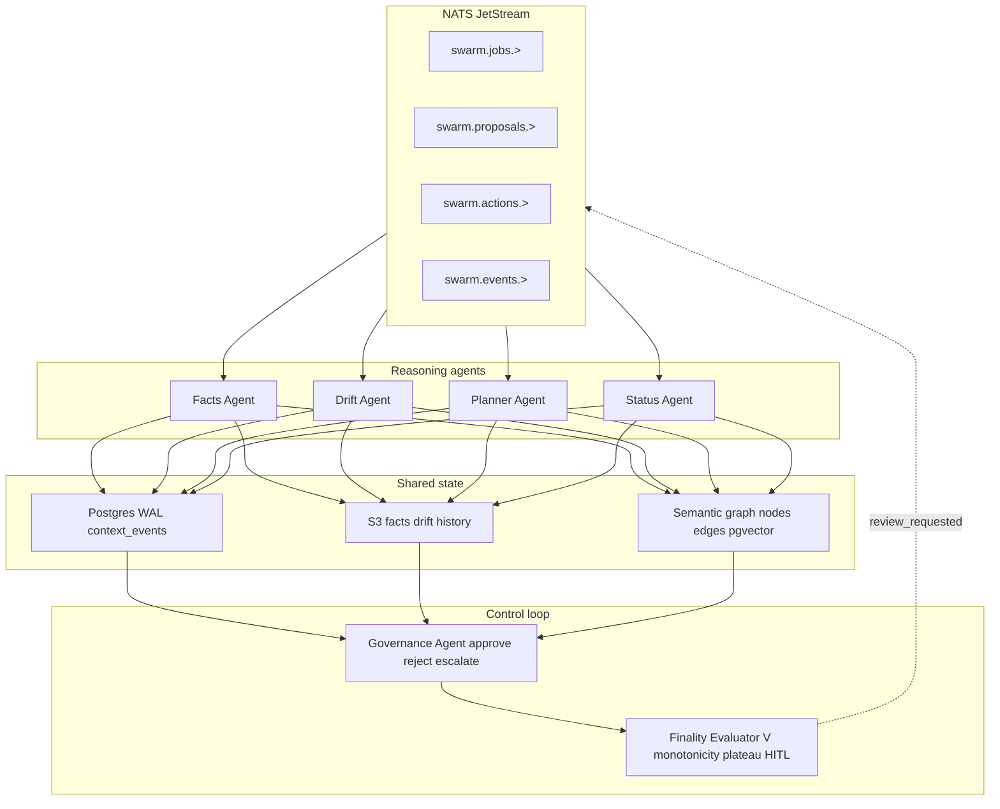
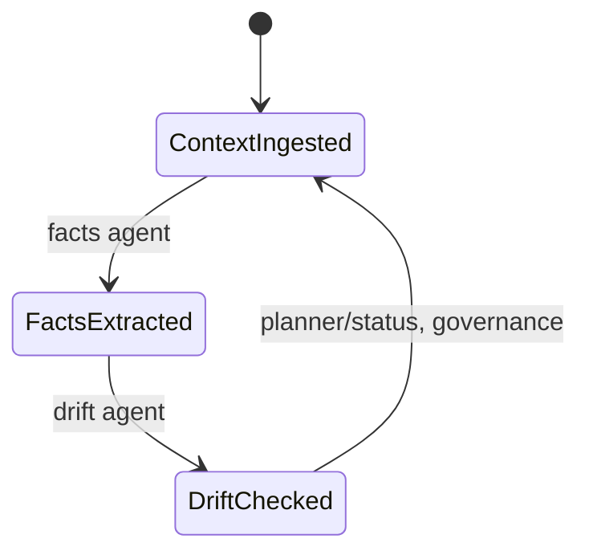
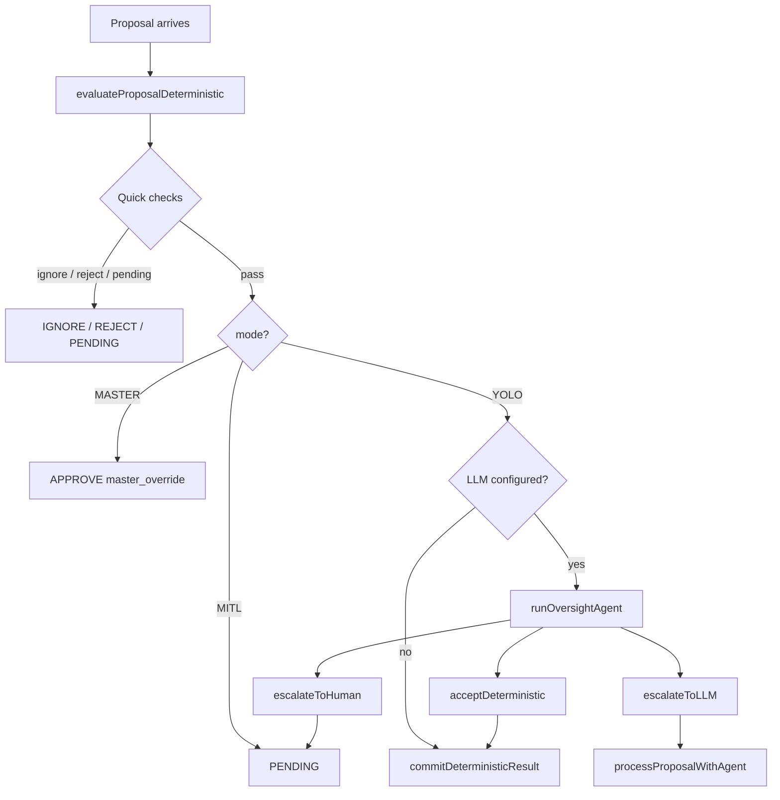
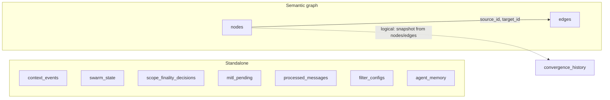

# Architecture

> Deep technical reference for the governed agent swarm.

Back to [README.md](../README.md).

---

## Table of contents

1. [Overview](#1-overview)
2. [Event bus (NATS JetStream)](#2-event-bus-nats-jetstream)
3. [State machine](#3-state-machine)
4. [Semantic graph](#4-semantic-graph)
5. [CRDT monotonic upserts](#5-crdt-monotonic-upserts)
6. [Convergence tracker](#6-convergence-tracker)
7. [Governance agent](#7-governance-agent)
8. [Activation filters](#8-activation-filters)
9. [Database schema](#9-database-schema)

---

## 1. Overview



The system has no fixed pipeline. Four reasoning agents (facts, drift, planner,
status) consume jobs from NATS, read shared state, and propose transitions.
The governance agent evaluates proposals against declarative rules and
authorization policy. The finality evaluator tracks convergence toward a
terminal state (RESOLVED, ESCALATED, BLOCKED, or EXPIRED).

---

## 2. Event bus (NATS JetStream)

**Source:** `src/eventBus.ts`

### Stream configuration

A single JetStream stream `SWARM_JOBS` (configurable via `NATS_STREAM` env)
carries all coordination messages. The stream is created with:

- **Subjects:** `swarm.jobs.>`, `swarm.proposals.>`, `swarm.actions.>`, `swarm.events.>`, `swarm.finality.>`
- **Retention:** `LimitsRetention` (messages retained until limits)
- **Storage:** `FileStorage` (persisted to disk)
- **Ack policy:** `AckPolicy.Explicit` -- consumers must explicitly acknowledge each message

### Subject hierarchy

| Subject pattern | Purpose | Producer | Consumer |
|-----------------|---------|----------|----------|
| `swarm.jobs.{jobType}` | Agent work items (e.g., `swarm.jobs.facts`) | Bootstrap, executor | Facts/drift/planner/status agents |
| `swarm.proposals.{transition}` | State transition proposals | Agents | Governance agent |
| `swarm.actions.{action}` | Approved actions to execute | Governance agent | Executor |
| `swarm.events.{eventType}` | System events (transitions, decisions) | Any | Feed server, audit |
| `swarm.finality.evaluate` | Finality evaluation triggers | Governance agent | Finality consumer loop |

### Pull consumers

All consumers are **durable pull consumers** (not push). Each agent creates a
named consumer (`pnpm run ensure-pull-consumers` pre-creates them) and fetches
messages in batches with explicit acknowledgment. This ensures:

- **Horizontal scaling:** Multiple instances of the same agent type can share
  a consumer (competing consumers pattern).
- **Backpressure:** Agents pull at their own pace; NATS does not push messages
  faster than agents can process.
- **Crash recovery:** Unacknowledged messages are redelivered after a timeout.

### Connection management

The `makeEventBus()` factory returns an `EventBus` interface with `publish`,
`consume`, `publishEvent`, and `close` methods. On close, the NATS connection
is drained (all pending messages flushed) before disconnect.

---

## 3. State machine

**Source:** `src/stateGraph.ts`

### Three-node cycle



The state machine has exactly three nodes forming a cycle. Each transition
represents a phase of the agent processing loop:

| Transition | What happens |
|------------|-------------|
| ContextIngested → FactsExtracted | Facts agent extracts claims, goals, risks from new context |
| FactsExtracted → DriftChecked | Drift agent compares current vs. previous facts, computes drift |
| DriftChecked → ContextIngested | Planner/status agents process drift, governance evaluates proposals, cycle resets |

### Epoch-based CAS (compare-and-swap)

Concurrency control uses an epoch counter with atomic compare-and-swap:

```sql
UPDATE swarm_state
SET last_node = $1, epoch = $2, updated_at = now()
WHERE scope_id = $3 AND epoch = $4
RETURNING run_id, last_node, epoch, updated_at

```

If `epoch` has changed since the agent read it (another agent advanced first),
the UPDATE matches zero rows and `advanceState` returns `null`. This prevents
two agents from advancing the same transition.

### Per-scope state

Since migration 007, the state table uses `scope_id TEXT PRIMARY KEY` instead of
a singleton row. Each scope has independent state, epoch, and run_id. The default
scope is `"default"` (configurable via `SCOPE_ID` env).

### Governance integration

When `advanceState` is called with `drift` and `governance` options, it first
evaluates `canTransition(from, to, drift, governance)`. If governance blocks the
transition (e.g., critical drift), the advance returns null without modifying
state. Every successful transition emits a `state_transition` event to the
context WAL.

---

## 4. Semantic graph

**Source:** `src/semanticGraph.ts`, `migrations/005_semantic_graph.sql`

### Storage

Postgres with the `pgvector` extension (vector 0.8.1+). Two tables:

**nodes** table:

| Column | Type | Notes |
|--------|------|-------|
| node_id | UUID PK | Auto-generated |
| scope_id | TEXT | Scope partition |
| type | TEXT | claim, goal, risk, assessment |
| content | TEXT | Natural language content |
| embedding | vector(1024) | pgvector embedding for similarity |
| confidence | FLOAT | Monotonically increasing via upserts |
| status | TEXT | active, resolved, irrelevant |
| source_ref | JSONB | Provenance metadata |
| metadata | JSONB | Arbitrary structured metadata |
| created_by | TEXT | Agent or source identifier |
| version | INT | Incremented on each update |

**edges** table:

| Column | Type | Notes |
|--------|------|-------|
| edge_id | UUID PK | Auto-generated |
| scope_id | TEXT | Scope partition |
| source_id | UUID FK | References nodes(node_id) CASCADE |
| target_id | UUID FK | References nodes(node_id) CASCADE |
| edge_type | TEXT | contradicts, resolves, supports |
| weight | FLOAT | Edge strength (default 1.0) |
| metadata | JSONB | Edge-specific metadata |
| created_by | TEXT | Creator identifier |

### Indexes

Six indexes optimize the primary access patterns:

- `idx_nodes_scope_type` -- scope + type + status (the most common query)
- `idx_nodes_scope_conf` -- scope + confidence, partial on status='active'
- `idx_nodes_created` -- scope + created_at for temporal ordering
- `idx_edges_scope_type` -- scope + edge_type
- `idx_edges_target` / `idx_edges_source` -- FK lookups for graph traversal

### Finality snapshot aggregation

`loadFinalitySnapshot` computes scope-level aggregates in a small number of
queries:

- `claims_active_min_confidence` -- minimum confidence among active claims
- `claims_active_avg_confidence` -- average confidence among active claims
- `contradictions_unresolved_count` -- contradictions with no resolving edge
- `goals_completion_ratio` -- resolved goals / total goals
- `scope_risk_score` -- sum of `risk_delta` from active assessments, clamped to [0,1]

A `pg_notify` trigger (`nodes_notify`) fires on every insert or update to the
`nodes` table, emitting `node_delta` events for real-time downstream consumers.

---

## 5. CRDT monotonic upserts

**Source:** `src/factsToSemanticGraph.ts`

The facts-to-graph synchronization layer uses a CRDT-inspired monotonic upsert
strategy (citing CodeCRDT, arXiv:2510.18893) to guarantee that the graph's
state only moves forward, never regresses.

### Three invariants

1. **Claims: upsert-if-better.** When syncing a new claim, the system matches
   against existing nodes by content similarity. If a match exists, confidence
   is updated only if `new_confidence >= existing_confidence`. The SQL guard:
   ```sql
   UPDATE nodes SET confidence = $2, version = version + 1
   WHERE node_id = $1 AND confidence <= $2
   ```
   This makes confidence a monotonically non-decreasing value per claim.

2. **Contradictions: irreversible resolution.** Before creating a `contradicts`
   edge, the system checks `hasResolvingEdge`. If a `resolves` edge already
   exists targeting either side of the contradiction pair, the contradiction
   is not re-created. Once resolved, a contradiction cannot re-open.

3. **Stale nodes: mark-irrelevant, never delete.** When a claim, goal, or risk
   from a previous sync round is no longer present in the latest facts, it is
   marked `status = 'irrelevant'` rather than deleted. This preserves
   append-only semantics and ensures that finality evaluation has a complete
   audit trail.

### Sync algorithm

```
syncFactsToSemanticGraph(scopeId, facts):
  BEGIN TRANSACTION
    existingClaims = queryNodesByCreator(scopeId, "facts-sync", "claim")
    existingGoals  = queryNodesByCreator(scopeId, "facts-sync", "goal")
    existingRisks  = queryNodesByCreator(scopeId, "facts-sync", "risk")

    FOR each new claim:
      match = matchExistingNode(existingClaims, content)
      IF match:
        updateNodeConfidence(match.id, confidence)  // only if >=
        markActive(match.id)
      ELSE:
        appendNode(type="claim", ...)

    FOR each new goal/risk:
      (similar upsert-or-insert logic)

    FOR each unmatched existing node:
      updateNodeStatus(node.id, "irrelevant")       // never delete

    FOR each contradiction:
      parse NLI format: "claimA" vs "claimB"
      IF NOT hasResolvingEdge(scopeId, sourceId, targetId):
        appendEdge(type="contradicts")
  COMMIT
```

After the transaction, if `embedClaims` is enabled, each new claim is
asynchronously embedded via the embedding pipeline.

---

## 6. Convergence tracker

**Source:** `src/convergenceTracker.ts`, migration `010_convergence_tracker.sql`

The convergence tracker implements five mechanisms from the distributed
consensus literature to detect whether the system is making progress toward
finality. For the full formal treatment, see [docs/convergence.md](convergence.md).

### Lyapunov disagreement function V(t)

Defined as a weighted quadratic distance to finality targets:

```
V(t) = SUM over dimensions d of:  w_d * (target_d - actual_d)^2
```

Where the four dimensions and their default weights are:

| Dimension | Weight | Target | Computed from |
|-----------|--------|--------|---------------|
| claim_confidence | 0.30 | 1.0 | avg_confidence / 0.85, clamped to 1 |
| contradiction_resolution | 0.30 | 1.0 | 1 - (unresolved / total) |
| goal_completion | 0.25 | 1.0 | resolved_goals / total_goals |
| risk_score_inverse | 0.15 | 1.0 | 1 - scope_risk_score |

V >= 0 always. V = 0 means perfect finality. V decreasing monotonically over
time guarantees asymptotic convergence (Olfati-Saber & Murray 2004).

### Convergence rate (alpha)

```
alpha = -ln(V(t) / V(t-1))
```

Averaged over the most recent 5 data points. Alpha > 0 means converging;
alpha < 0 means diverging. When alpha > 0 and V > epsilon (0.005):

```
estimated_rounds = ceil(-ln(epsilon / V_current) / alpha)
```

Capped at 1000 to avoid runaway estimates.

### Monotonicity gate

The goal score must be non-decreasing for beta consecutive rounds (default
beta = 3) before the system considers auto-resolution. A tolerance of 0.001
accommodates floating-point noise. This prevents premature closure from
transient score spikes.

### Plateau detection (MACI-inspired)

An exponential moving average (EMA) of the progress ratio detects stagnation:

```
progress_ratio = delta_score / remaining_gap
ema = alpha * progress_ratio + (1 - alpha) * ema_prev
```

When `ema < plateau_threshold` (default 0.01) for tau consecutive rounds
(default tau = 3), the system declares a plateau and triggers human-in-the-loop
escalation.

### Pressure-directed activation

Per-dimension pressure quantifies how far each dimension is from its target,
weighted:

```
pressure_d = w_d * max(0, 1 - actual_d)
```

The dimension with the highest pressure is the system's bottleneck. This
pressure vector is used by the `pressure_directed` activation filter to route
agent activity toward the dimension that needs the most work.

### Configuration defaults

| Parameter | Default | Purpose |
|-----------|---------|--------|
| beta | 3 | Monotonicity window (rounds) |
| tau | 3 | Plateau detection window (rounds) |
| ema_alpha | 0.3 | EMA smoothing factor |
| plateau_threshold | 0.01 | Progress ratio below = plateau |
| history_depth | 20 | DB rows loaded for analysis |
| divergence_rate | -0.05 | alpha below this triggers alert |

---

## 7. Governance agent

**Source:** `src/agents/governanceAgent.ts`, `governance.yaml`

The governance agent is the system's sole decision-maker for state transitions.
It consumes proposals from `swarm.proposals.>` and produces actions, rejections,
or pending-approval records.

### Three operating modes

| Mode | Behavior |
|------|----------|
| YOLO | Deterministic rule check, then oversight agent routes |
| MITL | Deterministic check passes, but always pends for human review |
| MASTER | Bypasses all checks; immediate approval (master override) |

The mode is set globally in `governance.yaml` and can be overridden per scope.

### Decision pipeline



Quick checks (in order): proposed_action != advance_state → IGNORE; epoch mismatch → REJECT; canTransition blocked → PENDING; checkPermission denied → REJECT.

### Oversight agent

When the mode is YOLO and an LLM model is configured, an oversight agent
(separate from the governance agent) evaluates the deterministic result and
chooses one of three paths:

1. **acceptDeterministic** -- commit the pre-computed result without LLM cost.
2. **escalateToLLM** -- invoke the full governance agent with tool-calling LLM
   for richer reasoning.
3. **escalateToHuman** -- route to human-in-the-loop (MITL) for manual review.

The oversight agent runs with a 30-second timeout and `maxSteps: 5`. If it
fails to call any tool, the system falls back to committing the deterministic
result.

### Governance rules (governance.yaml)

**Drift-triggered rules:**

| Drift level | Drift type | Action |
|-------------|-----------|--------|
| medium, high | contradiction | open_investigation |
| medium, high | goal | request_goal_refresh |
| high | factual | request_source_refresh |
| high | entropy | halt_and_review |

**Transition rules:**

| From | To | Block when | Reason |
|------|-----|-----------|--------|
| DriftChecked | ContextIngested | drift_level=critical | Critical drift blocks cycle reset -- human override required |

### OpenFGA policy checks

Every approved transition is gated by `checkPermission(agent, "writer",
target_node)`, which queries an OpenFGA authorization model. If the agent lacks
the `writer` relation on the target node, the proposal is rejected with
`policy_denied` and a policy violation metric is recorded.

### Audit trail

Every governance decision is recorded in the `context_events` WAL with:

- `type`: proposal_approved, proposal_rejected, proposal_pending_approval
- `proposal_id`: unique proposal identifier
- `reason`: human-readable rationale
- `governance_path`: which code path produced the decision (one of:
  processProposal, oversight_acceptDeterministic, oversight_escalateToLLM,
  oversight_escalateToHuman, processProposalWithAgent)

### Finality integration

After processing each proposal, the governance agent publishes a
`swarm.finality.evaluate` event. A dedicated consumer loop
(`runFinalityConsumerLoop`) processes these events, invoking the finality
evaluator. If the evaluator returns a review request (near-finality band), it
is submitted for HITL review via `submitFinalityReviewForScope`.

---

## 8. Activation filters

**Source:** `src/activationFilters.ts`

Activation filters are deterministic, zero-LLM-token gates that decide whether
an agent should execute. They are stored in Postgres and tunable by a tuner
agent at runtime.

### Five filter types

| Type | Semantics | Default agent |
|------|-----------|---------------|
| hash_delta | Activate when an S3 artifact's hash changes | drift, planner |
| sequence_delta | Activate when new context WAL events exceed a threshold | facts |
| timer | Activate after a time interval (short/full) | status |
| composite | Logical combination of other filters | (configurable) |
| pressure_directed | Activate when this agent's convergence dimension has highest pressure | (any) |

### Filter evaluation flow

```
checkFilter(config, memory, ctx):
  SWITCH config.type:
    sequence_delta:
      latestSeq = getLatestWalSeq()
      delta = latestSeq - memory.lastProcessedSeq
      RETURN delta >= minNewEvents AND NOT inCooldown

    hash_delta:
      currentHash = sha256(s3GetText(field))
      RETURN currentHash != memory.lastHash AND NOT inCooldown

    timer:
      elapsed = now - memory.lastActivatedAt
      RETURN elapsed >= shortIntervalMs

    pressure_directed:
      history = loadConvergenceHistory(scopeId, 1)
      agentPressure = SUM(pressure[dim] for dim in roleToDim[agentRole])
      maxPressure = MAX(all pressures)
      RETURN agentPressure >= maxPressure * 0.8
             AND agentPressure >= pressureThreshold
```

### Pressure-directed routing

The `pressure_directed` filter maps agent roles to convergence dimensions:

| Agent role | Dimensions |
|------------|-----------|
| facts | claim_confidence |
| drift | contradiction_resolution |
| planner | goal_completion, risk_score_inverse |
| status | all four dimensions |

An agent activates only when its mapped dimension has the highest (or near-
highest) pressure in the convergence tracker. This implements stigmergic
routing: agents self-organize toward the system's current bottleneck.

### Persistence

Two tables manage filter state:

**filter_configs** (agent_role PK):

| Column | Type | Purpose |
|--------|------|---------|
| agent_role | TEXT PK | Agent identifier |
| type | TEXT | Filter type |
| params | JSONB | Tunable parameters |
| stats | JSONB | Activation stats (tuner input) |
| version | BIGINT | Config version (CAS for tuner) |
| updated_by | TEXT | Last modifier |
| updated_at | TIMESTAMPTZ | Last modification time |

**agent_memory** (agent_role PK):

| Column | Type | Purpose |
|--------|------|---------|
| agent_role | TEXT PK | Agent identifier |
| last_processed_seq | BIGINT | WAL sequence watermark |
| last_hash | TEXT | Last seen artifact hash |
| last_drift_hash | TEXT | Last seen drift artifact hash |
| last_activated_at | TIMESTAMPTZ | Cooldown reference |
| data | JSONB | Arbitrary agent-specific state |

### Stats tracking

After each activation, `recordActivation` updates the filter's stats with:
- Total activations count
- Productive vs. wasted activations
- Running average latency

These stats feed the tuner agent, which adjusts filter parameters (cooldown
intervals, thresholds, sensitivity) to optimize the system's activation
efficiency.

---

## 9. Database schema

All tables are created by SQL migration files in the `migrations/` directory.
Migrations are numbered and applied in order.

### Migration 002: context_events

**File:** `migrations/002_context_wal.sql`

| Table | Purpose |
|-------|---------|
| context_events | Append-only write-ahead log for all system events |

| Column | Type | Notes |
|--------|------|-------|
| seq | BIGSERIAL PK | Auto-incrementing |
| ts | TIMESTAMPTZ | Event timestamp |
| data | JSONB | Event payload |

**Indexes:** `idx_context_events_ts` on `ts`.

### Migration 003: swarm_state (original)

**File:** `migrations/003_swarm_state.sql`

Original singleton state table with `id TEXT PK DEFAULT 'singleton'`.
Superseded by migration 007.

### Migration 005: semantic_graph

**File:** `migrations/005_semantic_graph.sql`

Creates the `nodes` and `edges` tables (detailed in Section 4), the pgvector
extension, six indexes, and the `nodes_notify` trigger for `pg_notify` on
insert/update.

### Migration 006: scope_finality_decisions

**File:** `migrations/006_scope_finality_decisions.sql`

| Table | Purpose |
|-------|---------|
| scope_finality_decisions | Human finality decisions for audit and dedup |

| Column | Type | Notes |
|--------|------|-------|
| scope_id | TEXT | Scope identifier |
| option | TEXT | approve_finality, provide_resolution, etc. |
| days | INT | Deferral period (nullable) |
| created_at | TIMESTAMPTZ | Decision timestamp |

**PK:** (scope_id, created_at). **Index:** scope_id + created_at DESC.

### Migration 007: swarm_state scope migration

**File:** `migrations/007_swarm_state_scope.sql`

Migrates `swarm_state` from singleton (`id` PK) to per-scope (`scope_id` PK).
Idempotent: checks column existence before migrating. Copies the singleton row
to `scope_id = 'default'`.

### Migration 008: mitl_pending

**File:** `migrations/008_mitl_pending.sql`

| Table | Purpose |
|-------|---------|
| mitl_pending | Proposals awaiting human-in-the-loop approval |

| Column | Type | Notes |
|--------|------|-------|
| proposal_id | TEXT PK | Unique proposal identifier |
| proposal | JSONB | Full proposal payload |
| action_payload | JSONB | Pre-computed action if approved |
| status | TEXT | pending, approved, rejected |
| created_at | TIMESTAMPTZ | Submission timestamp |

**Index:** `idx_mitl_pending_status` on `status`.

### Migration 009: processed_messages

**File:** `migrations/009_processed_messages.sql`

| Table | Purpose |
|-------|---------|
| processed_messages | Idempotency guard for NATS consumer dedup |

| Column | Type | Notes |
|--------|------|-------|
| consumer_name | TEXT | Consumer identifier |
| message_id | TEXT | NATS message sequence ID |
| processed_at | TIMESTAMPTZ | Processing timestamp |

**PK:** (consumer_name, message_id). **Index:** `processed_at`.

### Migration 010: convergence_history

**File:** `migrations/010_convergence_tracker.sql`

| Table | Purpose |
|-------|---------|
| convergence_history | Append-only convergence tracking per scope |

| Column | Type | Notes |
|--------|------|-------|
| id | BIGSERIAL PK | Auto-incrementing |
| scope_id | TEXT | Scope identifier |
| epoch | BIGINT | State machine epoch at evaluation |
| goal_score | FLOAT | Composite finality score |
| lyapunov_v | FLOAT | Lyapunov disagreement value |
| dimension_scores | JSONB | Per-dimension scores |
| pressure | JSONB | Per-dimension pressure values |
| created_at | TIMESTAMPTZ | Evaluation timestamp |

**Indexes:** `idx_convergence_history_scope` (scope_id, created_at DESC),
`idx_convergence_history_scope_epoch` (scope_id, epoch DESC).

### Additional runtime-created tables

Two tables are created at runtime by `ensureStateTable` and `ensureFilterTable`
rather than by migrations:

- **swarm_state** -- also created by stateGraph.ts if not present
- **filter_configs** and **agent_memory** -- created by activationFilters.ts

These duplicate the migration schemas but use `CREATE TABLE IF NOT EXISTS` for
resilience in environments where migrations have not been applied.

---

## Summary of table relationships


