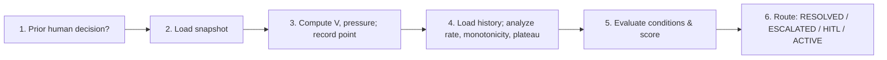
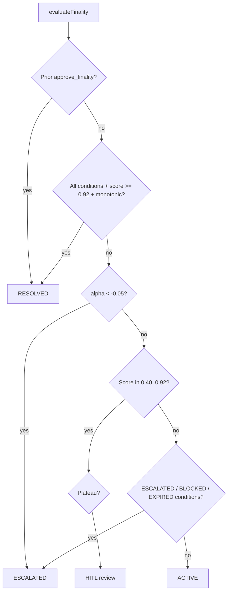

# Convergence Theory and Configuration

> Formal convergence tracking for finality gradient descent in governed agent swarms.

Back to [README.md](../README.md).

---

## Table of contents

1. [Problem statement](#1-problem-statement)
2. [Five mechanisms](#2-five-mechanisms)
3. [Integration with finality evaluator](#3-integration-with-finality-evaluator)
4. [Configuration reference](#4-configuration-reference)
5. [Monotonic graph upserts](#5-monotonic-graph-upserts)
6. [Benchmark scenarios](#6-benchmark-scenarios)
7. [References](#7-references)

---

## 1. Problem statement

The original `evaluateFinality()` was **memoryless**: each invocation computed a fresh goal score from a snapshot and checked it against a threshold. This design suffers from four failure modes that are well-documented in distributed systems and multi-agent coordination literature:

**Transient spikes.** A single evaluation cycle where all dimensions happen to align (e.g., a batch of claims arrives with high confidence) can push the goal score above the auto-finality threshold. The system declares RESOLVED. On the next cycle, the score drops back below threshold -- but the case is already closed. Memoryless evaluation has no mechanism to distinguish a genuine steady state from a transient spike.

**Oscillation.** Agents working in parallel can create alternating improvement and regression. The facts agent raises claim confidence; the drift agent detects a contradiction that lowers the contradiction resolution score. The system oscillates around a value without ever converging. A threshold check sees each snapshot in isolation and cannot detect the pattern.

**Stagnation.** The system reaches a plateau at, say, 0.70. All dimensions are partially satisfied but no agent is making progress. Without memory of previous scores, the evaluator cannot detect that nothing has changed. Agents continue cycling, consuming resources, producing no value. There is no trigger for human intervention.

**No ETA.** Even when the system is converging, a memoryless evaluator cannot estimate how many more cycles are needed. Operators have no visibility into whether finality is minutes or hours away, making resource allocation and scheduling impossible.

The convergence tracker (`src/convergenceTracker.ts`) transforms finality from a memoryless threshold check into a **stateful process** with formal convergence guarantees. It maintains a history of evaluation points and applies five mechanisms from the research literature to detect convergence, divergence, plateau, and bottleneck dimensions.

---

## 2. Five mechanisms

```mermaid
flowchart LR
  subgraph inputs["Inputs"]
    S[Snapshot]
    H[History]
  end
  subgraph mech["Mechanisms"]
    V[V(t) Lyapunov]
    ALPHA[Convergence rate alpha]
    MONO[Monotonicity gate]
    PLAT[Plateau detection]
    PRESS[Pressure-directed]
  end
  S --> V & ALPHA & PRESS
  H --> ALPHA & MONO & PLAT
  V --> ALPHA
```

### 2.1 Lyapunov disagreement function V(t)

**Definition.** A scalar non-negative function that measures the aggregate weighted distance of all finality dimensions from their targets. V = 0 means perfect finality; V > 0 means at least one dimension is below target.

**Formula.**

```
V(t) = sum over d of ( w_d * (target_d - actual_d)^2 )
```

where:
- `d` ranges over four dimensions: `claim_confidence`, `contradiction_resolution`, `goal_completion`, `risk_score_inverse`
- `w_d` is the weight for dimension `d` (default: 0.30, 0.30, 0.25, 0.15)
- `target_d` is the target value for dimension `d` (default: 1.0 for all dimensions)
- `actual_d` is the current normalized score for dimension `d` in [0, 1]

**Properties.**
- V(t) >= 0 for all t (non-negative by construction).
- V(t) = 0 if and only if all dimensions are at their targets.
- If V(t) is strictly decreasing over time, the system is asymptotically converging toward finality.
- The quadratic form penalizes large gaps more heavily than small ones, creating a natural gradient toward the worst-performing dimension.

**Dimension score computation.** Each dimension is normalized to [0, 1]:
- `claim_confidence` = min(avg_confidence / 0.85, 1)
- `contradiction_resolution` = 1 - (unresolved / total), or 1 if no contradictions exist
- `goal_completion` = goals_completion_ratio
- `risk_score_inverse` = 1 - min(scope_risk_score, 1)

**Literature.** Olfati-Saber & Murray (2004) introduced Lyapunov-based analysis for multi-agent consensus, proving that if a common Lyapunov function decreases monotonically, the system converges to agreement. We adapt this by treating finality dimensions as "agents" that must agree with their targets.

### 2.2 Convergence rate and ETA

**Definition.** The exponential decay rate of V(t), averaged over recent transitions. Positive alpha means V is decreasing (converging); negative alpha means V is increasing (diverging); alpha near zero means stalled.

**Formula.**

```
alpha = -ln( V(t) / V(t-1) )
```

averaged over the most recent min(|history|, 5) consecutive pairs. The implementation clamps the ratio to avoid log(0) when V reaches zero.

**ETA estimation.** Given the current V(t) and a target epsilon (default 0.005), the estimated rounds to finality is:

```
ETA = ceil( -ln(epsilon / V(t)) / alpha )
```

This assumes exponential decay continues at the current rate. The estimate is capped at 1000 rounds; values above this return null (unreliable). If V(t) is already below epsilon, ETA = 0.

**Properties.**
- Alpha > 0: system is converging; ETA is finite and meaningful.
- Alpha < 0: system is diverging; ETA is null. If alpha < divergence_rate (default -0.05), the evaluator triggers ESCALATED.
- Alpha near 0: system is stalled; ETA is null. Plateau detection (section 2.4) handles this case.

**Implementation note.** The rate is averaged over up to 5 recent pairs rather than computed from a single pair. This smooths out noise from individual transitions while remaining responsive to trend changes.

### 2.3 Monotonicity gate

**Definition.** The goal score must be non-decreasing for beta consecutive rounds before the system is eligible for automatic resolution. This prevents premature finality from transient spikes.

**Formula.** Let `s(t)` be the goal score at round t. The monotonicity predicate is:

```
is_monotonic = for all i in [t - beta + 1, t]:  s(i) >= s(i-1) - epsilon
```

where epsilon = 0.001 (tolerance for floating-point noise). The default beta is 3 rounds.

**Properties.**
- The gate is a necessary condition for auto-RESOLVED, not a sufficient one. All hard conditions (claims, contradictions, goals, risk) must also hold.
- A single drop of more than 0.001 in any of the last beta rounds resets the gate.
- The gate requires at least beta data points; with fewer, `is_monotonic` is false.
- This is a purely local property: it only examines the last beta rounds, not the entire history.

**Literature.** Duan et al. (2025) describe coordination invariants for state machine replication in the Aegean protocol. The monotonicity gate adapts their requirement that committed state must not regress -- applied here to the goal score rather than a replicated log.

### 2.4 Plateau detection

**Definition.** The system is considered plateaued when the exponential moving average (EMA) of the progress ratio stays below a threshold for tau consecutive rounds. A plateau triggers human-in-the-loop review because the system is no longer making meaningful progress.

**Formula.** At each round t, the progress ratio is:

```
progress_ratio(t) = max(0, s(t) - s(t-1)) / max(auto_threshold - s(t), 0.001)
```

The EMA is updated as:

```
EMA(t) = ema_alpha * progress_ratio(t) + (1 - ema_alpha) * EMA(t-1)
```

with `ema_alpha` = 0.3 (default). The plateau predicate is:

```
is_plateaued = (consecutive rounds where EMA < plateau_threshold) >= tau
```

with `plateau_threshold` = 0.01 and `tau` = 3 (defaults).

**Properties.**
- The progress ratio measures improvement relative to the remaining gap, not absolute improvement. A delta of 0.01 at score 0.90 (gap 0.02) counts more than a delta of 0.01 at score 0.50 (gap 0.42).
- Negative deltas are clamped to 0 in the numerator. Regression does not cancel out previous plateau rounds.
- The EMA provides smoothing: a single good round does not instantly clear a plateau.
- During divergence, progress ratio is 0 (deltas are negative, clamped to 0), so plateau is also detected. This is correct: the system is both diverging and stalled. The divergence rate (alpha < -0.05) is the primary signal; plateau is secondary.

**Literature.** Camacho et al. (2024) describe EMA-based stagnation detection in their MACI framework for multi-agent collective intelligence. The progress ratio formulation adapts their approach to the finality gradient domain.

### 2.5 Pressure-directed activation

**Definition.** Per-dimension pressure quantifies how far each dimension is from its target, weighted by importance. The dimension with the highest pressure is the current bottleneck. This information is used for stigmergic agent routing: agents activate preferentially on the dimension that most needs attention.

**Formula.**

```
pressure_d = w_d * max(0, 1 - actual_d)
```

for each dimension d. The highest-pressure dimension is:

```
highest_pressure_dimension = argmax_d( pressure_d )
```

**Properties.**
- Pressure is always non-negative.
- A dimension at target (actual_d = 1) has zero pressure.
- The weight scaling ensures that pressure reflects both the gap and the dimension's importance in the goal score.
- When multiple dimensions have equal pressure, the first one encountered is reported (implementation detail, not semantically meaningful).

**Literature.** Dorigo, Theraulaz, & Trianni (2024) survey stigmergic coordination in swarm intelligence, where agents respond to environmental signals (pheromones, gradients) rather than explicit messages. Pressure-directed activation adapts this principle: the convergence state is the "pheromone map" and agents activate where pressure is highest.

---

## 3. Integration with finality evaluator

The `evaluateFinality(scopeId)` function in `src/finalityEvaluator.ts` runs as a six-step workflow after each governance cycle. The convergence tracker is integrated at steps 3 and 4.

### 3.1 Workflow steps



| Step | Action | Source |
|------|--------|--------|
| 1 | Check for prior human-approved finality decision | `finalityDecisions.ts` |
| 2 | Load finality snapshot from semantic graph | `semanticGraph.ts` |
| 3 | Compute Lyapunov V, pressure, dimension scores; record convergence point to DB | `convergenceTracker.ts` |
| 4 | Load convergence history and analyze state (rate, monotonicity, plateau) | `convergenceTracker.ts` |
| 5 | Evaluate finality conditions and goal score against thresholds | `finalityEvaluator.ts` |
| 6 | Route to appropriate outcome (RESOLVED, ESCALATED, HITL review, or ACTIVE) | `finalityEvaluator.ts` |

If the convergence tracker is unavailable (e.g., the `convergence_history` table does not exist), the evaluator degrades gracefully: the monotonicity gate defaults to true (permissive) and convergence data is omitted from the HITL review payload.

### 3.2 Decision path



### 3.3 Decision path table

| Condition | Convergence state | Outcome |
|-----------|-------------------|---------|
| Human previously approved finality | Any | RESOLVED |
| All RESOLVED conditions met, score >= auto (0.92), monotonicity gate satisfied | is_monotonic = true | RESOLVED |
| All RESOLVED conditions met, score >= auto (0.92), monotonicity gate not satisfied | is_monotonic = false | Remains ACTIVE (gate blocks premature finality) |
| Convergence rate alpha < divergence_rate (-0.05), history >= 3 points | Diverging | ESCALATED |
| Score in [near (0.40), auto (0.92)), plateau detected | is_plateaued = true | HITL review (with convergence context) |
| Score in [near (0.40), auto (0.92)), not plateaued | is_plateaued = false | HITL review (standard) |
| ESCALATED conditions met (risk >= 0.75, contradictions >= 3, etc.) | Any | ESCALATED |
| BLOCKED conditions met (idle >= 5, stale >= 300s, contradictions >= 1) | Any | BLOCKED |
| EXPIRED conditions met (inactive >= 30 days) | Any | EXPIRED |
| None of the above | Any | ACTIVE (keep iterating) |

### 3.4 HITL review payload

When the score is in the near-finality range, a `FinalityReviewRequest` is constructed with:
- Goal score, threshold values, and gap
- Per-dimension breakdown with scores, weights, and status (ok/partial/blocking)
- List of specific blockers (unresolved contradictions, critical risks, low confidence, missing goals)
- Convergence data: rate, ETA, Lyapunov V, plateau status, highest-pressure dimension, score history
- LLM-generated explanation (via Ollama, if available)
- Suggested actions derived from blockers
- Four action options: approve finality, provide resolution, escalate, defer (7 days)

The convergence section of the HITL prompt enables the LLM to assess whether the system is making progress, whether waiting for more cycles is reasonable, or whether human intervention is needed now.

---

## 4. Configuration reference

All configuration lives in `finality.yaml` at the repository root.

### 4.1 Goal gradient weights

```yaml
goal_gradient:
  weights:
    claim_confidence: 0.30
    contradiction_resolution: 0.30
    goal_completion: 0.25
    risk_score_inverse: 0.15
  near_finality_threshold: 0.40
  auto_finality_threshold: 0.92
```

| Parameter | Default | Description | Tuning guidance |
|-----------|---------|-------------|-----------------|
| `weights.claim_confidence` | 0.30 | Weight for claim confidence dimension | Increase for domains where evidence quality is critical (e.g., scientific review) |
| `weights.contradiction_resolution` | 0.30 | Weight for contradiction resolution dimension | Increase for adversarial or multi-source domains (e.g., due diligence) |
| `weights.goal_completion` | 0.25 | Weight for goal completion dimension | Increase for task-oriented workflows with explicit deliverables |
| `weights.risk_score_inverse` | 0.15 | Weight for inverse risk score dimension | Increase for safety-critical domains; decrease for exploratory analysis |
| `near_finality_threshold` | 0.40 | Goal score at which HITL review becomes eligible | Lower to catch cases earlier; raise to reduce review noise |
| `auto_finality_threshold` | 0.92 | Goal score at which auto-RESOLVED is possible (if all conditions met) | Lower only if false negatives are more costly than false positives |

Weights must sum to 1.0. The Lyapunov function, pressure computation, and goal score all use these same weights.

### 4.2 Convergence parameters

```yaml
convergence:
  beta: 3
  tau: 3
  ema_alpha: 0.3
  plateau_threshold: 0.01
  history_depth: 20
  divergence_rate: -0.05
```

| Parameter | Default | Description | Tuning guidance |
|-----------|---------|-------------|-----------------|
| `beta` | 3 | Monotonicity window: require score non-decreasing for this many rounds before auto-resolve | Increase for higher safety (more rounds of stability required); decrease for faster finality |
| `tau` | 3 | Plateau detection window: consecutive rounds below progress threshold to declare plateau | Increase to tolerate longer stalls before triggering HITL; decrease for earlier intervention |
| `ema_alpha` | 0.3 | EMA smoothing factor for progress ratio (0 = no smoothing, 1 = no memory) | Lower values make plateau detection slower to trigger but more robust to noise |
| `plateau_threshold` | 0.01 | Progress ratio below which a round counts as plateaued | Raise to be more aggressive about detecting stalls; lower to tolerate slower progress |
| `history_depth` | 20 | Number of convergence points to load from the database for analysis | Increase for longer-running scopes; keep low for fast scopes to reduce query cost |
| `divergence_rate` | -0.05 | Convergence rate alpha below which the system triggers ESCALATED | Make more negative to tolerate brief regressions; make less negative for stricter divergence detection |

### 4.3 Finality condition rules

```yaml
finality:
  RESOLVED:
    mode: all
    conditions:
      - claims.active.min_confidence: 0.85
      - contradictions.unresolved_count: 0
      - risks.critical.active_count: 0
      - goals.completion_ratio: ">= 0.90"
      - scope.risk_score: "< 0.20"
```

These are the hard conditions that must be satisfied (in addition to the goal score threshold and monotonicity gate) for automatic resolution. The `mode: all` means every condition must hold. Conditions support operators `>=`, `<=`, `>`, `<`, `==`.

The full set of recognized condition keys:
- `claims.active.min_confidence` -- minimum confidence among active claims
- `contradictions.unresolved_count` -- number of unresolved contradictions (target: 0)
- `risks.critical.active_count` -- number of active critical risks (target: 0)
- `goals.completion_ratio` -- ratio of resolved goals to total goals
- `scope.risk_score` -- aggregate risk score for the scope
- `scope.idle_cycles` -- number of cycles with no state change
- `scope.last_delta_age_ms` -- milliseconds since last state delta
- `scope.last_active_age_ms` -- milliseconds since last activity
- `assessments.critical_unaddressed_count` -- unaddressed critical assessments

---

## 5. Monotonic graph upserts

The monotonicity gate (section 2.3) requires that the goal score does not decrease between consecutive rounds. This requirement propagates a constraint onto the semantic graph: **state changes must not cause the goal score to regress**.

The semantic graph sync uses CRDT-inspired monotonic upserts to satisfy this constraint:

- **Claim confidence only increases.** When a claim is re-extracted with a higher confidence, the node is updated. When re-extracted with a lower confidence, the existing value is retained. This ensures the `claim_confidence` dimension score is a ratchet.
- **Resolution edges are irreversible.** Once a contradiction is marked resolved, the resolution edge cannot be deleted. This ensures the `contradiction_resolution` dimension score does not decrease.
- **Goal completion is additive.** Goal resolution records are appended, never removed. The `goal_completion` ratio can only increase.
- **Stale nodes are marked irrelevant, not deleted.** Removing a node could lower a dimension score (e.g., removing a high-confidence claim lowers the average). Instead, nodes are flagged and excluded from future aggregation, preserving the current aggregate.

**Why this matters for the monotonicity gate.** If graph updates could cause score regression, the monotonicity gate would trigger false negatives: the system might be genuinely converging but a graph update causes a brief dip, resetting the beta-round counter. Monotonic upserts ensure that any score decrease reflects a genuine change in the underlying domain (e.g., new contradictory evidence), not a bookkeeping artifact.

This design follows the CRDT principle that merge operations must be commutative, associative, and idempotent. Laddad et al. (2024) formalize this for collaborative editing; we apply it to semantic graph operations where the "merge" is a finality-aware upsert.

---

## 6. Benchmark scenarios

The benchmark harness (`scripts/benchmark-convergence.ts`) runs seven pure-math scenarios with no external dependencies (no Docker, no Postgres, no NATS, no LLM). Each scenario generates a sequence of `FinalitySnapshot` values, converts them to `ConvergencePoint` records, and runs `analyzeConvergence()` to verify the outcome.

Run with:

```bash
pnpm tsx scripts/benchmark-convergence.ts
```

| # | Scenario | Description | Expected outcome | What it validates |
|---|----------|-------------|------------------|-------------------|
| 1 | Steady convergence | All dimensions improve by ~5% per round over 15 rounds | Converging, monotonic, no plateau, ETA near 0 | V(t) decreases monotonically; monotonicity gate passes; no false plateau during fast improvement |
| 2 | Plateau at 0.70 | Score oscillates around 0.70 with +/- 0.002 jitter for 10 rounds | Not converging, plateaued, not monotonic | EMA-based plateau detection triggers after tau rounds of negligible progress |
| 3 | Spike-and-drop | Score rises to 0.95 then drops to 0.70 | Positive average rate (3/4 transitions improve), not monotonic, has ETA | Monotonicity gate blocks premature finality despite positive convergence rate; demonstrates why the gate is necessary |
| 4 | Divergence | Contradictions increase each round; all dimensions worsen over 6 rounds | Diverging (alpha < 0), plateaued (progress clamped to 0), not monotonic | Negative convergence rate detection; plateau co-occurs with divergence (correct: zero forward progress) |
| 5 | One-dimension bottleneck | 3 dimensions at target; contradiction_resolution stuck at 0.25 for 5 rounds | Not converging, plateaued, monotonic (constant score), highest pressure = contradiction_resolution | Pressure-directed activation correctly identifies the blocking dimension |
| 6 | Fast convergence | Reaches 0.92+ in 3 rounds with large jumps | Converging, monotonic, no plateau | No false plateau during rapid convergence; system correctly reports near-zero or zero ETA |
| 7 | Empty graph | No claims, no goals, score = 0.15 (only risk_inverse contributes) | Not converging, not plateaued, not monotonic | Safe defaults with single data point; no division by zero; no crashes on degenerate input |

Each scenario validates a specific failure mode or edge case. Together they cover the five mechanisms: V(t) computation, convergence rate, monotonicity gate, plateau detection, and pressure identification.

---

## 7. References

1. **Olfati-Saber, R. & Murray, R. M.** (2004). Consensus Problems in Networks of Agents With Switching Topology and Time-Delays. *IEEE Transactions on Automatic Control*, 49(9), 1520--1533. doi:[10.1109/TAC.2004.834113](https://doi.org/10.1109/TAC.2004.834113)
   -- Lyapunov stability framework for multi-agent consensus. Foundation for the disagreement function V(t) and the convergence guarantee: if V is a common Lyapunov function that decreases along system trajectories, the system converges to consensus.

2. **Duan, S., Reiter, M. K., & Zhang, H.** (2025). Aegean: Making State Machine Replication Fast without Compromise. *arXiv preprint* arXiv:[2512.20184](https://arxiv.org/abs/2512.20184)
   -- Monotonicity gates and coordination invariants for state machine replication. The Aegean protocol requires that committed state does not regress; we adapt this as the monotonicity gate for the goal score.

3. **Camacho, D. et al.** (2024). MACI: Multi-Agent Collective Intelligence. *arXiv preprint* arXiv:[2510.04488](https://arxiv.org/abs/2510.04488)
   -- EMA-based stagnation detection for multi-agent systems. The MACI framework uses progress ratio monitoring to detect when collective improvement has stalled; we adapt their approach for plateau detection in the finality gradient.

4. **Laddad, S. et al.** (2024). CodeCRDT: A Conflict-Free Replicated Data Type for Collaborative Code Editing. *arXiv preprint* arXiv:[2510.18893](https://arxiv.org/abs/2510.18893)
   -- CRDT monotonic merge operations. The principle that merge must be commutative, associative, and idempotent underlies our monotonic graph upserts.

5. **Dorigo, M., Theraulaz, G., & Trianni, V.** (2024). Swarm Intelligence: Past, Present, and Future. *Proceedings of the Royal Society B*, 291(2024). doi:[10.1098/rspb.2024.0856](https://doi.org/10.1098/rspb.2024.0856)
   -- Stigmergic coordination in biological and artificial swarms. Agents respond to environmental gradients (pheromone trails) rather than direct communication. Pressure-directed activation adapts this: the convergence pressure map serves as the gradient signal.

---

*Source files: [`src/convergenceTracker.ts`](../src/convergenceTracker.ts), [`src/finalityEvaluator.ts`](../src/finalityEvaluator.ts), [`src/hitlFinalityRequest.ts`](../src/hitlFinalityRequest.ts), [`finality.yaml`](../finality.yaml), [`scripts/benchmark-convergence.ts`](../scripts/benchmark-convergence.ts), [`test/unit/convergenceTracker.test.ts`](../test/unit/convergenceTracker.test.ts).*
