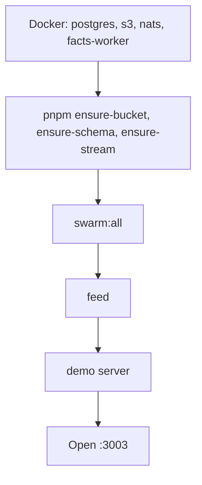
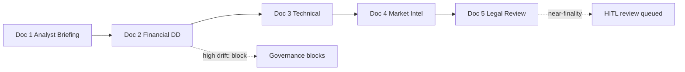

# Demo Guide

[Back to README](../README.md)

---

## Overview

**Project Horizon** is an M&A due diligence scenario. A strategic buyer evaluates the acquisition of **NovaTech AG**, a B2B SaaS company in supply chain compliance. Five documents arrive over time, each revealing new facts, contradictions, and risks. The governed agent swarm processes them in real time, enforces policy at every transition, and escalates to a human at the right moment.

This is the front door. For the full step-by-step walkthrough with commands, expected states, and SQL queries, see [demo/DEMO.md](../demo/DEMO.md).

---

## What it demonstrates

| Capability | How it appears in the demo |
|---|---|
| Structured knowledge extraction | Claims, goals, and risks extracted as typed nodes in a semantic graph |
| Contradiction detection | Doc 2 reveals a EUR 12M ARR overstatement; the system creates a contradiction edge |
| Governance intervention | High drift blocks the state transition; the cycle cannot silently proceed |
| Declarative policy | `governance-demo.yaml` rules fire without code changes |
| Near-finality HITL review | Goal score crosses 0.75 but not 0.92; the system queues a structured human review |
| Audit trail | Every transition logged with proposer, approver, rationale, and timestamp |

---

## Quick start



```bash
# 1. Infrastructure
docker compose up -d postgres s3 nats facts-worker

# 2. Migrations and streams
pnpm install
pnpm run ensure-bucket && pnpm run ensure-schema && pnpm run ensure-stream

# 3. Start the swarm (agents + governance + executor)
export GOVERNANCE_PATH="$(pwd)/demo/scenario/governance-demo.yaml"
pnpm run swarm:all

# 4. Start the feed server (port 3002)
pnpm run feed

# 5. Start the demo server (port 3003)
pnpm run demo
```

Open [http://localhost:3003](http://localhost:3003) to begin the walkthrough.

---

## The 5 documents



| # | Document | Key event |
|---|---|---|
| 1 | Initial Analyst Briefing | Baseline: EUR 50M ARR, 7 patents, 45% CAGR. No contradictions. Finality score low (~0.15-0.30). |
| 2 | Financial Due Diligence | ARR revised to EUR 38M. High drift detected. Governance **blocks** the transition. |
| 3 | Technical Assessment | CTO and two senior engineers departing. Risk nodes accumulate. Medium drift triggers escalation. |
| 4 | Market Intelligence | Patent infringement suit filed. Multiple unresolved contradictions. Possible ESCALATED state. |
| 5 | Legal Review | Partial resolution of contradictions. Goal score crosses near-finality threshold. HITL review queued. |

---

## Key governance moments

| Moment | Trigger | Why it matters |
|---|---|---|
| Cycle blocked after Doc 2 | High drift (ARR contradiction) hits `transition_rules` block | A EUR 12M discrepancy is not silently absorbed |
| `open_investigation` recommended | Contradiction drift at high level | Governance tells the planner to flag this formally |
| `request_external_audit` recommended | Value discrepancy drift | Internal documents alone cannot resolve the financial dispute |
| `escalate_to_risk_committee` | Risk drift at medium level (Doc 3) | Critical personnel risks require structured escalation |
| Near-finality HITL triggered | Goal score crosses 0.75 but not 0.92 (Doc 5) | The system has enough to recommend but not enough to decide -- the right moment for human judgment |
| Decision recorded | Every HITL choice stored in `scope_finality_decisions` | The decision is part of the permanent audit trail regardless of outcome |

---

## Running options

### Option A -- Demo UI (recommended)

```bash
pnpm run demo
# Open http://localhost:3003
```

Narrative walkthrough with live event stream, real-time state panel, governance highlighting, HITL modal, and speed control.

### Option B -- Shell walkthrough

```bash
./demo/run-demo.sh           # interactive, with pauses
./demo/run-demo.sh --fast    # automated, no pauses
./demo/run-demo.sh --step 3  # start at a specific step
```

### Option C -- Background seed (headless)

```bash
pnpm run seed:demo                        # 20s gap between documents
DEMO_DELAY_MS=10000 pnpm run seed:demo   # 10s gap
DEMO_DOC=02 pnpm run seed:demo            # single document
```

Monitor via the feed dashboard at [http://localhost:3002](http://localhost:3002).

---

## Full walkthrough

The complete demo with per-step expected states, curl commands, SQL queries, governance mode switching, and exploration ideas is in:

**[demo/DEMO.md](../demo/DEMO.md)**
