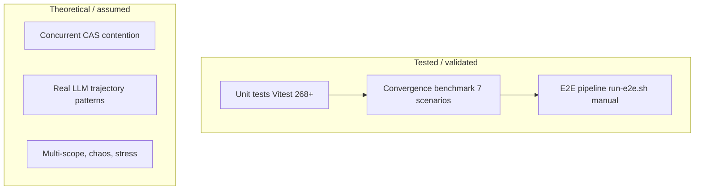

# Validation and Test Coverage

> Back to [README](../README.md) | See also [STATUS.md](../STATUS.md)

This document provides an honest accounting of what is tested, what is validated
mathematically, and what remains theoretical or unverified. The goal is
intellectual honesty: readers should understand exactly where the evidence stops
and where assumptions begin.

---

## 1. What is tested vs what is theoretical

| Aspect | Tested / Validated | Theoretical / Assumed |
|--------|-------------------|-----------------------|
| State graph transitions (CAS, cycle) | Unit tests with mocked Postgres | Linearizability under concurrent writers (single-row CAS, no multi-node contention test) |
| Governance rules (YAML evaluation) | Unit tests against `governance.yaml` | That rule set is complete for production drift taxonomies |
| Governance modes (MASTER/MITL/YOLO) | Unit tests + E2E seed + verification script | That three modes cover all real operational needs |
| Oversight agent (LLM-backed) | Unit test for no-LLM fallback path | LLM-backed oversight quality (accept/escalate decisions) |
| Convergence tracker (Lyapunov V, pressure, monotonicity, plateau, Gate C oscillation/trajectory) | 32 unit tests + 7-scenario benchmark (pure math) | That synthetic snapshot trajectories represent real LLM-generated fact sequences |
| Finality evaluator (RESOLVED, ESCALATED, review, Gate C/D, certificates) | 13 unit tests with mocked snapshots + convergence state | That finality thresholds generalize across domains |
| Semantic graph (nodes, edges, CRDT upserts) | 7 unit tests for factsToSemanticGraph, 2 for semanticGraph | Graph integrity under concurrent writers from multiple agents |
| Embedding pipeline (Ollama bge-m3) | 11 unit tests (mocked fetch, dimension checks) | Embedding quality and semantic similarity accuracy |
| HITL finality request | 3 unit tests with mocked evaluateFinality | Human response quality and decision turnaround |
| MITL server (approve/reject/resolve) | 9 unit tests with in-memory pool | Operational correctness under network partitions |
| Facts agent (extract, write, Mastra) | 4 unit tests + 1 conditional OpenAI test | Extraction accuracy across document types |
| E2E pipeline (Docker, all services) | `run-e2e.sh` script (manual, ~2 min) | Pipeline stability under sustained load |
| Policy (OpenFGA) | 4 unit tests with mocked fetch | OpenFGA model completeness and correctness |
| Event bus (NATS JetStream) | 7 unit tests with mocked NATS | Message ordering and exactly-once delivery under backpressure |

---

## 2. Unit tests (Vitest)

**268 tests across 33 files.** All run with `pnpm test` (no Docker, no network).

| Test file | Tests | Coverage area | Key assertions |
|-----------|-------|--------------|----------------|
| `contextWal.test.ts` | 5 | Context WAL append/tail/since | JSONB insert + RETURNING seq, DESC query reversed to ASC, eventsSince with seq > afterSeq |
| `logger.test.ts` | 6 | Structured JSON logger | Valid JSON output, extra fields, persistent context, stderr for errors, log level filtering |
| `agentRegistry.test.ts` | 6 | Agent specs and state graph alignment | No duplicate roles/jobTypes, requiresNode/advancesTo valid in transition map, getSpec lookup |
| `s3.test.ts` | 3 | S3 put/get helpers | PutObjectCommand with JSON + content-type, HeadObject 404 returns null, body stream to text |
| `events.test.ts` | 5 | SwarmEvent envelope | createSwarmEvent defaults (id, ts, source), opts override, isSwarmEvent true/false for valid/invalid shapes |
| `eventBus.test.ts` | 7 | NATS JetStream event bus | publish returns seq id, consume processes + acks, publishEvent uses swarm.events prefix, close drains |
| `policy.test.ts` | 4 | OpenFGA policy checks | Default allow when no store ID, allowed/denied via mock fetch, ECONNREFUSED denial |
| `governance.test.ts` | 17 | Governance YAML rules + transition rules | loadPolicies parses YAML, evaluateRules matches drift level/type, canTransition blocks critical drift, scope overrides |
| `stateGraph.test.ts` | 11 | State machine transitions + Postgres CAS | Pure transitions cycle through 3 nodes, epoch increment, CAS failure returns null, advanceState emits WAL event, initState with ON CONFLICT, governance-blocked advance |
| `convergenceTracker.test.ts` | 32 | Lyapunov V, pressure, dimension scores, analyzeConvergence, Gate C | V=0 for perfect, pressure highest on worst dim, monotonicity/plateau, convergence rate, ETA, spike-and-drop, oscillation detection, trajectory quality, coordination_signal |
| `finalityEvaluator.test.ts` | 13 | Finality evaluation pipeline | loadFinalitySnapshot, loadFinalityConfig, computeGoalScore, RESOLVED with Gate C/D, review, divergence, certificate payload, quiescence |
| `finalityDecisions.test.ts` | 4 | Finality decision persistence | recordFinalityDecision INSERT with scope/option/days, getLatestFinalityDecision returns latest or null |
| `factsToSemanticGraph.test.ts` | 7 | Facts-to-graph sync (CRDT) | Insert claims/goals/risks, NLI contradiction edge parsing, monotonic confidence (preserve higher), stale nodes marked irrelevant, resolved contradictions not re-created, reactivation of irrelevant nodes |
| `semanticGraph.test.ts` | 2 | Semantic graph queries | loadFinalitySnapshot returns correct shape with computed ratios, appendResolutionGoal inserts goal with status resolved |
| `embeddingPipeline.test.ts` | 11 | Embedding generation + persistence | Empty when no Ollama, empty for blank text, empty on fetch failure, empty on wrong dimension, valid 1024-dim vector, batch returns map, updateNodeEmbedding no-op for wrong length, embedAndPersistNode true/false |
| `hitlFinalityRequest.test.ts` | 4 | HITL finality submission | Returns false when evaluateFinality returns null or status, adds to MITL pending when review with correct payload shape |
| `policyEngine.test.ts` | 3 | Policy engine (YAML) | DecisionRecord shape, allow/deny from transition rules, policy_version passthrough |
| `policyVersions.test.ts` | 3 | Policy version hashes | getGovernancePolicyVersion / getFinalityPolicyVersion return 64-char hex or no-file |
| `combiningAlgorithms.test.ts` | 6 | Combining algorithms | denyOverrides (deny wins, no_policies), firstApplicable |
| `finalityCertificates.test.ts` | 4 | Finality certificates (JWS) | buildCertificatePayload, signCertificate compact JWS, verifyCertificate round-trip, invalid JWS throws |
| `mitlServer.test.ts` | 9 | MITL pending queue operations | addPending + getPending round-trip, approvePending publishes + removes, not_found for unknown, rejectPending publishes rejection, finality_review blocks regular approve (use_finality_response), resolveFinalityPending publishes to swarm.actions.finality, defer with days |
| `modelConfig.test.ts` | 18 | Model configuration resolution | Ollama base URL (null/blank/trimmed), default models (qwen3:8b, phi4-mini, mistral-small:22b, bge-m3), finality thresholds (defaults, env, clamping), getChatModelConfig (null/Ollama/OpenAI/preference), getOversightModelConfig (null/same/override) |
| `metrics.test.ts` | 5 | OpenTelemetry metrics | recordProposal/PolicyViolation/AgentLatency/TaskResolutionTime/TaskCost do not throw |
| `telemetry.test.ts` | 5 | OpenTelemetry init/shutdown | initTelemetry idempotent, getTracer returns startSpan, getMeter returns createCounter/createHistogram, shutdownTelemetry resolves |
| `agents/factsAgent.test.ts` | 4 | Facts agent pipeline | Reads WAL + S3, calls worker /extract, writes facts + drift + history to S3, handles no previous facts, runFactsPipelineDirect sequence, createFactsMastraAgent exposes tools |
| `agents/factsAgent.mastra-openai.test.ts` | 1 | Mastra + OpenAI integration | Conditional: only runs when OPENAI_API_KEY set; verifies Agent.generate returns OK |
| `agents/driftAgent.test.ts` | 2 | Drift agent | Reads drift from S3, writes history snapshot, handles missing drift |
| `agents/plannerAgent.test.ts` | 3 | Planner agent | Returns evaluated actions from governance rules, empty actions for no drift, handles missing drift file |
| `agents/statusAgent.test.ts` | 2 | Status agent | Reads facts + drift, appends status card to WAL, handles missing data (unknown level) |
| `agents/governanceAgent.test.ts` | 18 | Governance agent (all paths) | YOLO approve (low drift), critical drift escalates to pending, high drift approves (only critical blocks), MITL adds to pending (no immediate action), evaluateProposalDeterministic: ignore/reject/approve/pending for each mode, commitDeterministicResult publishes correctly, runOversightAgent falls back to deterministic when no LLM, runFinalityCheck calls evaluateFinality and conditionally submitFinalityReviewForScope |
| `seedFixture.test.ts` | 9 | Seed data and context_doc events | HITL scenario fixture shape (claims/goals/risks/edges), seed-docs directory listing, createSwarmEvent context_doc payload |

---

## 3. Convergence benchmark (7 scenarios)

**Pure math. No Docker, no Postgres, no NATS, no LLM.**

Run: `pnpm tsx scripts/benchmark-convergence.ts`

The benchmark generates synthetic `FinalitySnapshot` sequences, pipes them through
`computeLyapunovV`, `computePressure`, `computeDimensionScores`, and
`analyzeConvergence`, then checks outcomes against expectations.

| Scenario | Rounds | What it tests | Expected outcome |
|----------|--------|--------------|------------------|
| Steady convergence | 15 | All dimensions improve ~5%/round | Converging, monotonic, no plateau, V near 0 |
| Plateau at 0.70 | 10 | Score oscillates around 0.70 with tiny jitter | Plateau detected, not converging, not monotonic |
| Spike-and-drop | 5 | Score spikes to 0.95 then drops to 0.70 | Monotonicity gate broken despite positive avg rate |
| Divergence | 6 | Contradictions increase each round, confidence drops | Diverging (rate < 0), plateau flagged (stalled), no ETA |
| One-dimension bottleneck | 5 | 3 dims at target, contradiction_resolution stuck at 25% | Plateau, highest pressure = contradiction_resolution |
| Fast convergence | 3 | Reaches 0.92+ in 3 rounds | Converging, monotonic, no false plateau |
| Empty graph | 1 | No claims, no goals, zero snapshot | Safe defaults, no crash, no convergence |

All 7 scenarios must pass for the benchmark to exit 0. The benchmark validates
the mathematical properties of the convergence tracker (Lyapunov stability
theory applied to finality scoring) but does **not** validate that real LLM
output produces trajectories that match these synthetic patterns.

---

## 4. E2E pipeline

**Script:** `scripts/run-e2e.sh`
**Duration:** ~2 minutes (excluding Docker image build on first run; facts-worker
pip install can add 3-5 minutes on cold start).
**Requires:** Docker, `psql` on PATH, `.env` with either `OPENAI_API_KEY` or
host Ollama running.

### Steps

| Step | What it does | What it proves |
|------|-------------|----------------|
| 1 | `docker compose up -d postgres s3 nats facts-worker feed` | Infrastructure starts |
| 2 | Wait for Postgres (`pg_isready`), then `check-services.ts` (Postgres, S3, NATS, facts-worker, feed; up to 300s) | All services reachable before proceeding |
| 2b | `reset-e2e.ts` | Clean slate (DB tables, S3 objects, NATS streams) |
| 3 | Run migrations 002, 003, 005, 006 via `psql` | Schema is correct and migrations are idempotent |
| 4 | `ensure-bucket.ts` + `ensure-stream.ts` | S3 bucket and NATS stream exist |
| 5 | `seed-all.ts` + `bootstrap-once.ts` | Seed documents ingested, state initialized |
| 5b | `ensure-pull-consumers.ts` | Durable pull consumers (fixes push consumer errors) |
| 5c | `seed-governance-e2e.ts` | State set to DriftChecked/epoch 5, drift=high, 3 proposals published |
| 6 | Start 6 processes (facts, drift, planner, status, governance, executor) | All agents start and consume jobs without crashing |
| 7 | `curl /summary` | Feed server responds, context is populated |
| 8 | POST a document to `/context/docs` | Document ingestion triggers facts pipeline |
| 9 | Wait 40s, `curl /summary` again | Facts extracted and written (S3 + semantic graph) |
| 10 | Query `nodes` table (GROUP BY type) | Semantic graph populated with claim/goal/risk nodes |
| 11 | Query `edges` table (GROUP BY edge_type) | Contradiction/resolves edges created |
| 12 | `verify-governance-paths.ts` | Governance audit trail verified (see section 5) |

The E2E script is **not automated in CI**. It requires Docker and either an
OpenAI key or a running Ollama instance. It is run manually before releases.

---

## 5. Governance path auditing

### Seed: `seed-governance-e2e.ts`

Sets up a deterministic scenario:
- **State:** DriftChecked, epoch 5, runId "seed-governance-e2e"
- **Drift:** high (written to S3 as `drift/latest.json`)
- **Proposals:** Three proposals for the same transition (DriftChecked -> ContextIngested, epoch 5), each with a different mode

### Verify: `verify-governance-paths.ts`

Queries `context_events` for governance decision records and checks:

| Mode | Expected outcome | Verification |
|------|-----------------|--------------|
| **MASTER** | Approved with `governance_path: "processProposal"`, `reason: "master_override"` | At least one `proposal_approved` event matches |
| **MITL** | Pending with `governance_path: "processProposal"` | At least one `proposal_pending_approval` event matches (warning if absent due to timing) |
| **YOLO** | Rejected with reason containing "drift" | At least one `proposal_rejected` event matches (path may be `processProposal` or `oversight_acceptDeterministic` depending on LLM availability) |

The verifier exits 0 only if MASTER-approved and YOLO-rejected are both found.
MITL-pending is checked but produces a warning rather than a hard failure (timing
sensitivity with NATS consumption order).

### Audit trail

Every proposal decision written to the context WAL includes a `governance_path`
field. Possible values: `processProposal`, `oversight_acceptDeterministic`,
`oversight_escalateToLLM`, `oversight_escalateToHuman`,
`processProposalWithAgent`. This allows post-hoc auditing of which code path
produced each decision.

---

## 6. HITL finality scenario

### Seed: `seed-hitl-scenario.ts`

Populates the semantic graph with a deterministic state designed to land the
goal score in the near-finality band (between `NEAR_FINALITY_THRESHOLD` and
`AUTO_FINALITY_THRESHOLD`), preventing auto-resolution.

**What it creates (scope: default):**
- 5 claim nodes (confidence 0.9, active)
- 5 goal nodes (4 resolved, 1 active -- so goals_completion_ratio = 4/5 = 0.80)
- 2 risk nodes (high severity, active)
- 2 contradiction edges (claims[0] vs claims[2], claims[1] vs claims[4])
- 1 resolves edge (resolving the first contradiction only)

**Net state:** One unresolved contradiction remains. Goal score falls in the
review band because contradiction_resolution < 1 and goals_completion_ratio < 1.

### What triggers

When the swarm runs and governance calls `runFinalityCheck(scopeId)`:

1. `evaluateFinality` loads the snapshot from the semantic graph
2. Goal score is computed and falls in [near, auto) range
3. `evaluateFinality` returns `{ kind: "review", request: { ... } }`
4. `submitFinalityReviewForScope` creates a MITL pending entry with the finality review
5. The feed server shows near_finality with dimension breakdown, blockers, and suggested actions

### Expected output

- MITL pending queue contains a `finality_review` proposal from `finality-evaluator`
- The review payload includes: `goal_score`, `dimension_breakdown` (claim_confidence, contradiction_resolution, goal_completion, risk_score_inverse), `blockers` (unresolved contradiction), and `options` (approve_finality, reject_finality, defer, request_more_info)
- A human operator can respond via the MITL API (`POST /mitl/:id/finality-response`)

---

## 7. Known validation gaps

This section is intentionally candid. The following areas have **no automated
validation** and represent known gaps:

1. **No stress testing.** There are no tests for behavior under high message
   throughput, large semantic graphs (10k+ nodes), or sustained concurrent
   agent activity. The CAS mechanism in `advanceState` is tested for single
   conflicts but not for contention from multiple agents racing.

2. **No chaos testing.** There are no tests for service failures (Postgres
   restart, NATS partition, S3 unavailability) during pipeline execution.
   The system is designed for graceful degradation (e.g., embedding failures
   are logged and skipped) but this has not been validated systematically.

3. **No multi-scope E2E.** All E2E testing uses `scope_id = "default"`. The
   governance system supports per-scope mode overrides (e.g., `financial_dd: MITL`)
   and the semantic graph is scoped, but no E2E test exercises multiple scopes
   simultaneously.

4. **Convergence validated with math only, not real LLM data.** The convergence
   tracker is validated against synthetic snapshot trajectories (unit tests and
   benchmark). The assumption that real LLM-extracted facts produce trajectories
   resembling these synthetic patterns is unvalidated. Real fact extraction
   may exhibit non-smooth, multi-modal, or adversarial drift patterns not
   captured by the 7 benchmark scenarios.

5. **Demo not automated in CI.** The E2E script (`run-e2e.sh`) requires Docker
   and either an OpenAI API key or a running Ollama instance. It is not wired
   into any CI pipeline. Regressions between commits are caught only by the
   unit test suite.

6. **LLM oversight quality unvalidated.** When an LLM is configured, the
   oversight agent chooses between accepting the deterministic result,
   escalating to a full LLM evaluation, or escalating to a human. The quality
   of this triage decision has not been evaluated (no accuracy benchmarks, no
   confusion matrix, no A/B testing).

7. **Embedding semantic accuracy untested.** The embedding pipeline is tested
   for dimensional correctness (1024-d vectors, graceful failures) but not for
   semantic quality. Whether bge-m3 embeddings produce meaningful similarity
   scores for the types of claims, goals, and risks in this system is assumed,
   not measured.

8. **HITL decision quality unmeasured.** The HITL flow is mechanically tested
   (seed scenario triggers review, pending entry created with correct shape)
   but the quality of human decisions and their downstream effects on finality
   convergence are not tracked or measured.

9. **No integration tests for NATS message ordering.** The event bus unit tests
   mock NATS entirely. JetStream delivery guarantees (at-least-once, consumer
   ack) are trusted but not verified in integration tests.

10. **Migration rollback untested.** Migrations are applied forward only. There
    are no down migrations and no tests for schema rollback.
